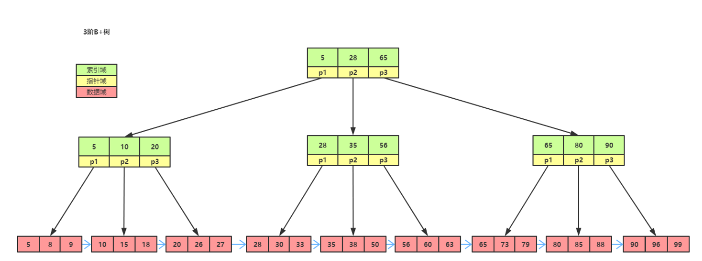
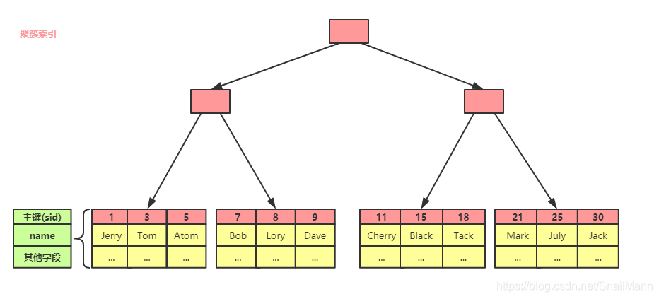
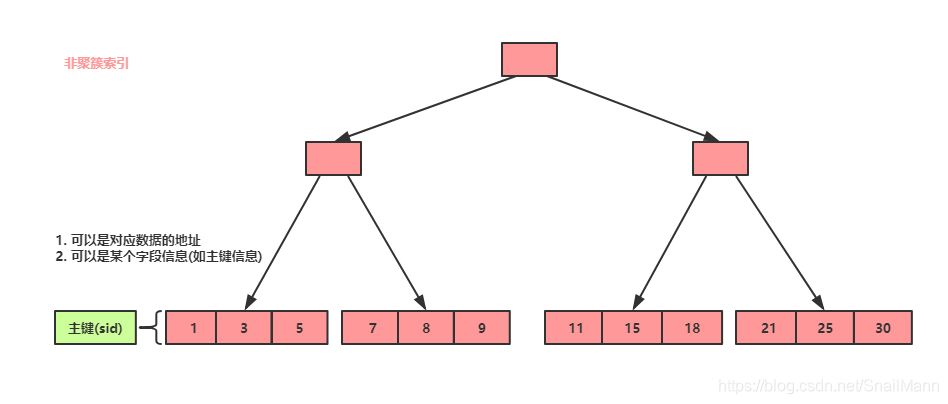
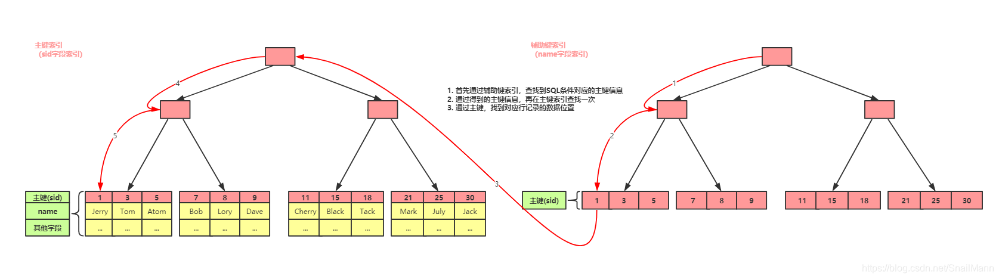

[第一部分:倾向于MySQL数据库索引的日常生活，主要体现MySQL索引的应用](https://blog.csdn.net/SnailMann/article/details/88594860)

[第二部分 更倾向于讲解MySQL B+树索引的实现原理](https://blog.csdn.net/SnailMann/article/details/95618910)

## MySQL数据库索引的底层实现是B+树
> B+树中每个节点存储的是一个数据页，每个数据页由`数据目录+行记录按照按照「主键」顺序组成的单向链表`组成，具体可以看[InnoDB是如何存储数据的](https://xiaolincoding.com/mysql/index/page.html#innodb-%E6%98%AF%E5%A6%82%E4%BD%95%E5%AD%98%E5%82%A8%E6%95%B0%E6%8D%AE%E7%9A%84)
### B+树为什么替换了B树称为MySQL索引的底层实现？

**B+树的磁盘读写代价更低**
因为B+树的中间结点存储的都是索引数据，仅仅是一个地址，并非直接的数据，所以同一个结点中（同一个磁盘页大小），B+树可容纳的关键字数会比B树更多（因为一个简单的地址几乎肯定小于一个直接的数据）。所以同样的数据量下，B+树会比B树更加“矮胖”，树高更小，所以查询时需要的IO次数就更少
**B+树的查询效率更加稳定**
因为B+树的所有元素都存储在叶子结点中，而叶子结点都属于同一层级，每一个B+树查询都是从根结点遍历到叶子结点的过程，所以不管查询什么，时间复杂度相比B树查询都更加的稳定和近似。
**B+树更有利对数据的扫描**
B树中虽然解决了查询的效率，但是如果需要查询一串相邻的数值，有可能需要回溯来回扫描或是从根结点多次中序遍历。而B+树的所有元素都存储叶子结点，每个叶子结点都有指向下一个结点的指针，直接线性遍历即可。同样B+树也更加的利于做范围查询

-------
### 主键索引和辅助键索引
简而言之，如果将一张表的所有字段都单独建立一个索引，那么除了以主键生成的索引外，其他都属于辅助键索引。
**（一）主键索引（Primary Index）**
以表的主键(primary key)创建的索引树，我们就称其为该表的主键索引
**（二）辅助键索引（Secondary Index）**
辅助键索引，又称辅助索引，次级索引，二级索引
辅助索引以表的非主键的字段创建的索引树，我们就称其为该表的辅助键索引

-----------------
### 聚簇索引和非聚簇索引
**（1）聚簇索引（Clustered Index）**
针对MySQL而言，聚簇索引只存在于InnoDB中，再具体些，如果有主键，一般指代的是InnoDB每个表的主键索引

**哪些索引属于聚簇索引？**

InnoDB和MyISAM之间，只有InnoDB支持聚簇索引
若一张表存在主键，则以该主键列生聚簇索引树
若一张表没有主键，则MySQL会找到该表的第一个唯一非空列的索引作为聚簇索引
如以上条件皆不满足，InnoDB会在内部生成一个名为GEN_CLUST_INDEX隐式聚簇索引。该索引是基于一个名为DB_ROW_ID的隐藏字段，通常称之隐式主键

--------
聚簇索引定义了数据存储在表中的顺序，每个表只能有一个聚簇索引。在RDBMS中，在存在主键的情况下，主键索引就是该聚簇索引

聚簇索引征就是将索引和数据存储在同一个文件中，既叶子结点不仅保存键的信息，还保存了位于同一行其他列的信息，简而言之，聚簇索引的叶子结点保存的是一个完整行记录数据

同时我们也能知道聚簇索引是一种有序索引，它的具体实现可以是稠密索引，也可以是稀疏索引

**（2）非聚簇索引（Non- Clustered Index）**
非聚簇索引将数据存储在一个位置，将索引存储在另一个位置，索引包含指向该数据位置的指针。这样的一个索引就是非聚簇索引，一个表中可以包含多个非聚簇索引

**哪些索引属于非聚簇索引**

说白了，InnoDB下的辅助键索引和MyISAM下的主、辅键索引都属于非聚簇索引，仅仅只有InnoDB下的主键索引（唯一非空列索引…之后细节忽视）才属于聚簇索引

----------------
非聚簇索引只存储键与指针，不存储数据，所以非聚簇索引的叶子结点仅保存数据的地址(MyISAM)或是其主键信息(InnoDB)。
使用非聚簇索引进行查询，最终会定位到叶子结点，得到数据地址或主键信息，。然后还要根据获得的地址或主键信息`从聚簇索引或者通过覆盖索引`进一步定位到数据，通常作为中间人的作用。

-----------
### 覆盖索引
**什么是覆盖索引？**

既在InnoDB中，只需要从辅助键索引中就可以查询到最终想要的数据结果，而不需要再从聚簇索引中二次查询。这么的一个技术手段，我们就称之为覆盖索引

覆盖索引在MySQL中，仅仅是针对InnoDB存储引擎而言的。准确的说，是针对聚簇索引和非聚簇索引共存的情况下才能起作用的

覆盖索引并不是一种索引类型，而是一种技术手段

**举例：**
在InnoDB存储引擎的表中：

比如我们在某个表建立了一个普通组合索引`(col1,col2,col3)`，由三个列组成。那么我们的`select col1,col2,col3 from table where col1 = xxx;`语句肯定会有覆盖索引的技术加持。只进行了一次`(col1,col2,col3)`辅助键索引，我们就可以得到`(col1,col2,col3)`三列数据的结果，自然也就不需要再拿到相关数据的主键，再跑到聚簇索引二次查询
比如我们在某个表，以`col1`字段建议一个普通索引，那么我们的`select col1 from table where col1 = xxx;`, 也会得到覆盖索引的技术加持。

----------------
### 通过非主键字段查询信息时，什么情况下利用覆盖索引（无需回表），什么情况下需要从聚簇索引中二次查询（回表）

**利用覆盖索引（无需回表）**
如果查询的字段全部包含在非主键索引的键值中，则InnoDB会直接通过覆盖索引返回结果，无需回表。例如：

**表结构**：主键为id，非主键索引为`idx_name_age (name, age)`。

**查询语句**：`SELECT name, age FROM table WHERE name = 'Alice'`。

**原因**：name和age均存储在idx_name_age的索引中，直接通过该索引即可获取数据。

此时，执行计划的Extra列会显示Using index，表明使用了覆盖索引。

**从聚簇索引中二次查询（回表）**

如果查询的字段未完全包含在非主键索引中，则InnoDB需要通过以下步骤完成查询：

通过非主键索引找到主键值（例如id）。

通过主键值回表到聚簇索引，获取完整的行数据。

返回需要的字段。

例如：

**表结构**：主键为id，非主键索引为`idx_name (name)`，表中还有字段address。

**查询语句**：`SELECT name, address FROM table WHERE name = 'Alice'`。

**原因**：idx_name仅包含name和主键id，但address不在索引中，因此需要回表查询聚簇索引获取address。

**关键点总结**
覆盖索引的条件：查询的字段必须全部存在于某个非主键索引中（包括索引字段和主键字段）。

回表的条件：查询的字段不全在非主键索引中，需依赖聚簇索引补充缺失字段。
