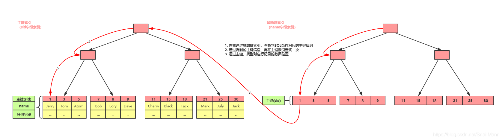
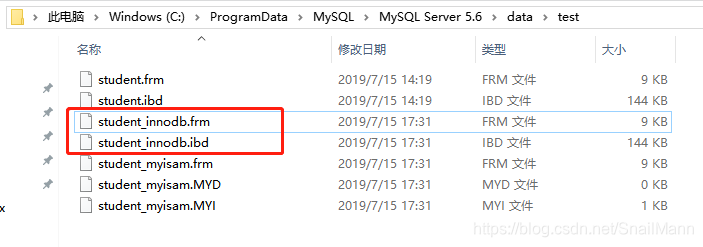
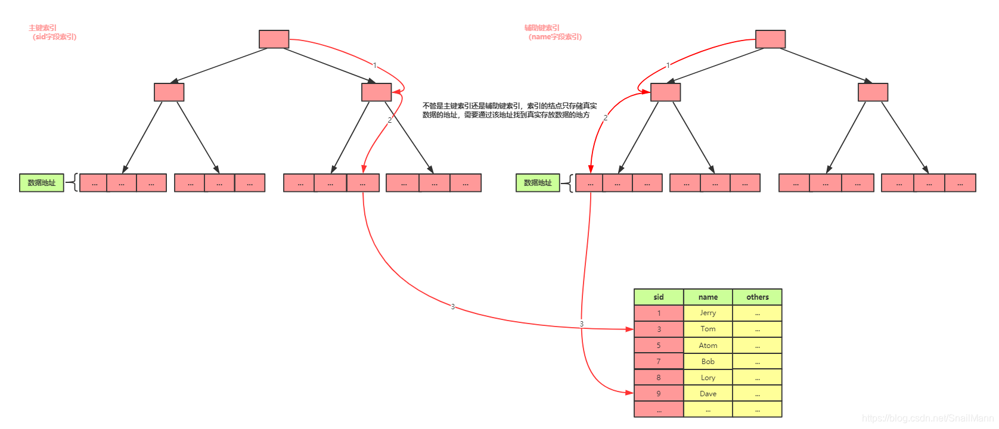
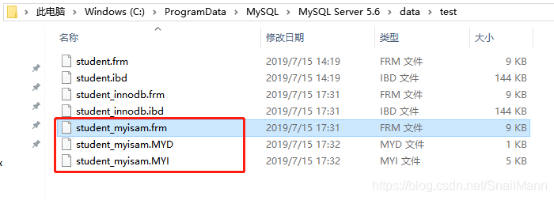

# 1.索引数据结构
都是B+树
但是

## InnoDB
**主键是聚簇索引，辅助键是非聚簇索引**，
主键的聚簇索引中B+ 树的`叶子节点存储的是主键ID索引和实际的数据`。
辅助键的非聚簇索引，B+ 树`叶子节点存储的是索引和数据的地址`，但可以通过覆盖索引这种技术手段实现非聚簇索引不需要回表，直接索引实际数据。

### 物理文件
创建一个，表，表名为student_innodb

可以看到有两个存储文件
`.frm`:
.frm文件是一份定义文件，也就是定义student_innodb表的结构，是一张怎么样的表
`.ibd`:
.ibd文件则是该表的索引，数据存储文件，既该表的所有索引树，所有行记录数据都存储在该文件中

## MyISAM 

**主键和辅助键索引都是非聚簇索引**，B+ 树`叶子节点存储的是索引和数据的地址`，它的`索引和实际数据是分开的`

### 物理文件
创建一个名为student_myisam的表

可以看到有三个存储文件
`.frm`：表定义文件,与InnoDB一致
`.MYD`：MYD文件是MyISAM存储引擎表的所有行数据的文件
`.MYI`：MYI文件存放的表的索引信息

# 2 InnoDB有日志机制，redolog可以支持安全恢复，MyISAM无日志机制不支持崩溃后的安全恢复

# 3 InnoDB支持事务，MyISAM不支持事务，
InnoDB实现了四种标准的隔离级别，利用MVCC来支持高并发，默认事务隔离级别为可重复读，支持行锁，利用行锁+间隙锁提供可重复读级别下防止幻读的能力

# 4. InnoDB支持外键，MyISAM不支持

>MyISAM 在事务、高并发读写、数据安全性等方面落后，现代应用多选InnoDB

# 使用场景和优势
## **InnoDB优势场景**

**高并发读写**：OLTP系统如电商订单、金融交易
**数据强一致**：需要事务支持的支付系统
**复杂查询**：通过行锁减少锁冲突，支持高频更新

## **MyISAM优势以及适用场景**
**1.读性能更高**：

数据和索引分离（.MYD 和 .MYI 文件），读操作直接访问数据文件，无需通过聚簇索引，适合大量读操作。
InnoDB 的聚簇索引可能导致读时额外开销。
**2.空间占用更小**：

索引文件（.MYI）只存储索引，不包含数据，整体文件大小更小。
InnoDB 的 .ibd 文件包含索引和数据，空间效率较低。
**3.简单性和低开销**：
无事务、锁机制，开销小，适合静态数据或只读场景。
启动快，维护简单。
**4.适用场景**
**读密集型操作**：数据仓库、报表分析（OLAP）
**静态数据管理**：CMS内容管理、历史日志归档