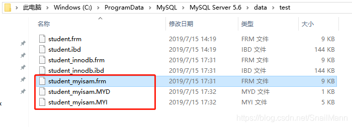

# (一) InnoDB的数据文件
我们创建一个名为student_innodb的表，存储引擎使用InnoDB, 然后在搜索电脑中存放student_innodb表数据文件的地方

可以看到两个文件，student_innodb.frm和student_innodb.ibd。熟悉的人肯定知道，这两个文件就是student_innodb表的表定义文件和数据文件

`student_innodb.frm`:
.frm文件是一份定义文件，也就是定义student_innodb表是一张怎么样的表
`student_innodb.ibd`:
.ibd文件则是该表的索引，数据存储文件，既该表的所有索引树，所有行记录数据都存储在该文件中
总之，我们可以知道，InnoDB的表，数据存储文件只有一个，既.ibd文件

# (二) MyISAM的数据文件
我们创建一个名为student_myisam的表，存储引擎使用MyISAM, 然后在搜索电脑中存放student_myisam表数据文件的地方

我们可以看到三个文件, student_myisam.frm, student_myisam.MYD和student_myisam.MYI文件。上面我们分析过了。.frm文件是表定义文件，不是数据文件。所以我们只关注MYD和MYI结尾的文件。

`student_myisam.frm`:
表定义文件,与InnoDB一致
`student_myisam.MYD`:
.MYD文件是MyISAM存储引擎表的所有行数据的文件
`student_myisam.MYI`:
.MYI文件存放的是MyISAM存储引擎表的索引信息
总之，我们可以简单的得出结论，MyISAM引擎下，表数据和表索引数据是分开存储的。

# (三) 总结

MyISAM存储引擎中的表数据和表索引数据是分开文件进行存储的
InnoDB存储引擎中的表数据和表索引数据是在同一个文件存储的
这也让我们更好的理解，为什么说InnoDB引擎下，整个表数据是存储在该表的聚簇索引树上的。
